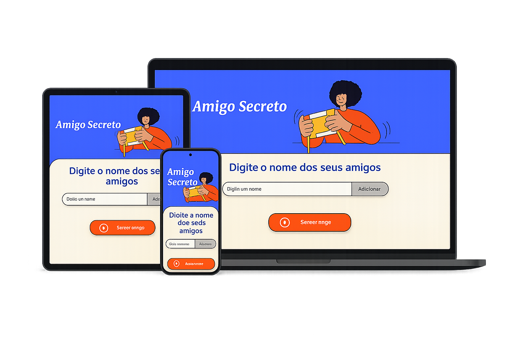

## 🎨 Preview do Projeto

# Amigo Secreto

Este é um projeto simples de Amigo Secreto feito em HTML, CSS e JavaScript.

## Funcionalidades

- Adicione nomes de amigos para participar do sorteio.
- Visualize a lista de amigos adicionados.
- Realize o sorteio do Amigo Secreto de forma aleatória.
- Interface amigável e responsiva.

## Como usar

1. Abra o arquivo `index.html` em seu navegador.
2. Digite o nome de cada amigo e clique em "Adicionar".
3. Após adicionar todos os nomes, clique em "Sortear amigo" para ver o resultado do sorteio.

## Estrutura do Projeto

- `index.html`: Página principal do projeto.
- `style.css`: Estilos para a interface.
- `app.js`: Lógica do sorteio e manipulação da lista de amigos.
- `assets/`: Imagens utilizadas no projeto.

## Pré-requisitos

- Navegador web moderno (Chrome, Firefox, Edge, etc).

## Tecnologias Usadas

- HTML
- CSS
- JAVASCRIPT

## Licença

Este projeto está licenciado sob a licença MIT. Veja o arquivo `LICENSE` para mais detalhes.
